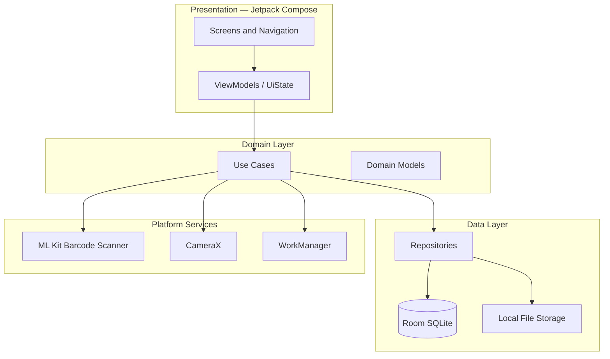

# 02 — Architecture

## High-Level Diagram



## Technology Stack

| Layer | Choice | Rationale |
|-------|--------|-----------|
| Language | Kotlin | Modern Android standard |
| UI | Jetpack Compose | Declarative, fast iteration |
| Navigation | Navigation Compose | Type-safe routes |
| Architecture | MVVM + use cases | Clear separation without over-abstraction |
| DI | Hilt | Standard Google DI |
| Database | Room + Flow | Reactive, offline, type-safe SQL |
| Images | Coil | Compose-friendly image loading |
| Barcode | ML Kit Barcode Scanning | Offline, accurate |
| Camera | CameraX | Stable preview + analysis pipeline |
| Charts | Vico or MPAndroidChart | Price and usage visualizations |
| Background | WorkManager | Expiry and replenishment reminders |
| Async | Coroutines + Flow | Structured concurrency |

## Package Structure

```
app/
├── ui/
│   ├── browse/          # House → room → container hierarchy
│   ├── item/            # Detail, add/edit, move
│   ├── scan/            # Camera scanner screen
│   ├── search/          # Global search
│   ├── consumable/      # Insights, price/usage charts
│   ├── lists/           # Shopping list, expiring soon
│   └── settings/
├── domain/
│   ├── model/
│   └── usecase/
├── data/
│   ├── local/
│   │   ├── entity/
│   │   ├── dao/
│   │   └── InventoryDatabase.kt
│   └── repository/
├── di/
└── util/                # Dates, currency, image compression
```

Defer multi-module Gradle splits until the codebase grows beyond ~15k LOC.

## Repository Layer

| Repository | Responsibility |
|------------|----------------|
| `HouseRepository` | CRUD houses, default house selection |
| `RoomRepository` | Rooms scoped to house |
| `ContainerRepository` | Containers, nesting, sort order |
| `ItemRepository` | Items, photos, search, barcode lookup, location path |
| `ConsumableRepository` | Cycles, expiry, usage stats, price trends, discard |
| `ScanRepository` | Scan history, barcode resolution |
| `ShoppingListRepository` | Restock queue |

## Core Use Cases

| Use Case | Description |
|----------|-------------|
| `GetLocationBreadcrumbUseCase` | "Kitchen › Pantry Cabinet › Top Shelf" |
| `AddItemWithScanUseCase` | Scan → lookup → create or navigate |
| `MoveItemUseCase` | Change container/room |
| `StartConsumableCycleUseCase` | Log purchase with price and expiry |
| `FinishConsumableCycleUseCase` | Set finish date, compute duration |
| `DiscardConsumableLotUseCase` | Mark expired/wasted stock |
| `GetExpiringItemsUseCase` | Items expiring within N days |
| `GetReplenishmentCandidatesUseCase` | Low stock + expiring + usage heuristics |
| `GetPriceTrendUseCase` | Unit price points over time |
| `ExportInventoryUseCase` | JSON/CSV backup |

## Domain Models (UI-Facing)

```kotlin
data class ItemWithLocation(
    val item: Item,
    val photos: List<ItemPhoto>,
    val locationPath: String,
    val openCycle: ConsumableCycle?,
    val currentExpiryDate: Long?,
    val avgUsageDays: Int?,
    val latestUnitPrice: Double?
)

data class ConsumableInsights(
    val cycles: List<ConsumableCycle>,
    val avgDurationDays: Double,
    val pricePoints: List<PricePoint>,
    val priceChangePercent: Double?,
    val expiredBeforeFinishCount: Int
)

data class ReplenishmentAlert(
    val item: Item,
    val reason: AlertReason,  // LOW_STOCK, EXPIRING_SOON, EXPIRED, USAGE_HEURISTIC
    val priority: Int,
    val detail: String
)
```

## File Storage

- Photos stored in app-specific storage (`Context.filesDir` or MediaStore for gallery picks)
- Database stores URI strings only
- Compress images on save (max ~1920px long edge, JPEG 85%)
- Receipt photos attached to consumable cycles

## Security and Privacy

- All data local by default
- No account required for MVP
- Export/import for user-controlled backup
- Camera permission requested with rationale screen

## Testing Strategy

| Layer | Focus |
|-------|-------|
| DAO | CRUD, cascade deletes, search queries, expiry date filters |
| Use cases | Cycle duration math, expiry alert rules, price calculations |
| ViewModel | State transitions on scan result, form validation |
| UI | Critical flows: add item, scan find, mark finished |

## Future Architecture Extensions

- `sync/` module for cloud backup (Firebase, Drive, or self-hosted)
- `widget/` for quick scan shortcut
- OCR module for expiry date extraction from packaging photos
