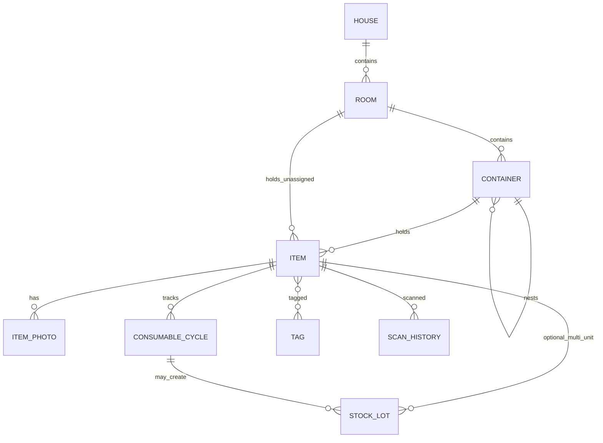

# 03 — Database Schema

Room/SQLite schema for hierarchical inventory, consumable lifecycle, expiry, and price tracking.

## ER Diagram



## Tables

### houses

| Column | Type | Notes |
|--------|------|-------|
| id | INTEGER PK | Auto-increment |
| name | TEXT NOT NULL | |
| address | TEXT | Optional |
| notes | TEXT | |
| cover_photo_uri | TEXT | |
| created_at | INTEGER | Epoch millis |
| updated_at | INTEGER | |

### rooms

| Column | Type | Notes |
|--------|------|-------|
| id | INTEGER PK | |
| house_id | INTEGER FK → houses | ON DELETE CASCADE |
| name | TEXT NOT NULL | |
| floor_label | TEXT | e.g. "Ground", "2nd" |
| notes | TEXT | |
| photo_uri | TEXT | |
| sort_order | INTEGER | Default 0 |

### containers

| Column | Type | Notes |
|--------|------|-------|
| id | INTEGER PK | |
| room_id | INTEGER FK → rooms | ON DELETE CASCADE |
| parent_id | INTEGER FK → containers | NULL; nested drawer/shelf |
| name | TEXT NOT NULL | |
| type | TEXT NOT NULL | CABINET, DRAWER, SHELF, BOX, BIN, OTHER |
| description | TEXT | |
| photo_uri | TEXT | |
| sort_order | INTEGER | Default 0 |

### items

| Column | Type | Notes |
|--------|------|-------|
| id | INTEGER PK | |
| container_id | INTEGER FK → containers | NULL if room-only |
| room_id | INTEGER FK → rooms | NULL if in container |
| name | TEXT NOT NULL | |
| description | TEXT | |
| category | TEXT | FOOD, CLEANING, TOOLS, MEDICINE, etc. |
| is_consumable | INTEGER | 0/1 boolean |
| quantity | REAL | Default 1 |
| unit | TEXT | pcs, g, ml, pack |
| min_quantity | REAL | Replenishment threshold |
| barcode | TEXT | EAN/UPC |
| qr_payload | TEXT | Raw QR content |
| brand | TEXT | |
| is_favorite | INTEGER | 0/1 |
| current_expiry_date | INTEGER | Denormalized; earliest active lot |
| created_at | INTEGER | |
| updated_at | INTEGER | |

**Constraint:** `container_id` OR `room_id` must be set (enforced in DAO/repository).

### item_photos

| Column | Type | Notes |
|--------|------|-------|
| id | INTEGER PK | |
| item_id | INTEGER FK → items | ON DELETE CASCADE |
| uri | TEXT NOT NULL | |
| is_primary | INTEGER | 0/1 |
| sort_order | INTEGER | |
| created_at | INTEGER | |

### consumable_cycles

One row = one purchase through finish (or discard). Source of truth for usage duration and price history.

| Column | Type | Notes |
|--------|------|-------|
| id | INTEGER PK | |
| item_id | INTEGER FK → items | ON DELETE CASCADE |
| purchase_date | INTEGER NOT NULL | Epoch millis |
| finish_date | INTEGER | NULL = still in use |
| expiry_date | INTEGER | NULL = no expiry |
| expiry_type | TEXT | USE_BY, BEST_BEFORE, NONE |
| opened_date | INTEGER | When seal broken |
| purchase_price | REAL | Total paid |
| currency | TEXT | Default from settings |
| quantity_purchased | REAL | |
| store_name | TEXT | |
| receipt_photo_uri | TEXT | |
| notes | TEXT | |

**Computed values (not stored):**

- `duration_days = finish_date - purchase_date` (or `now - purchase_date` if open)
- `unit_price = purchase_price / quantity_purchased`

### stock_lots (v1.3+)

For multiple units with different expiry dates (e.g. 3 yogurt cups).

| Column | Type | Notes |
|--------|------|-------|
| id | INTEGER PK | |
| item_id | INTEGER FK → items | ON DELETE CASCADE |
| cycle_id | INTEGER FK → consumable_cycles | Optional link to purchase |
| quantity | REAL NOT NULL | |
| expiry_date | INTEGER | |
| expiry_type | TEXT | USE_BY, BEST_BEFORE, NONE |
| opened_date | INTEGER | |
| status | TEXT | ACTIVE, FINISHED, DISCARDED |
| notes | TEXT | |
| created_at | INTEGER | |

Until v1.3, a single open cycle per item is sufficient for most households.

### tags / item_tags

```sql
tags (id, name UNIQUE)
item_tags (item_id, tag_id) — composite PK
```

### scan_history

| Column | Type | Notes |
|--------|------|-------|
| id | INTEGER PK | |
| raw_value | TEXT NOT NULL | |
| format | TEXT | EAN_13, QR_CODE, etc. |
| item_id | INTEGER FK → items | NULL if no match |
| scanned_at | INTEGER | |
| source | TEXT | ADD_ITEM, SEARCH, RESTOCK |

### shopping_list

| Column | Type | Notes |
|--------|------|-------|
| id | INTEGER PK | |
| item_id | INTEGER FK → items | |
| quantity | REAL | |
| added_at | INTEGER | |
| is_checked | INTEGER | 0/1 |

## Indexes

```sql
CREATE INDEX idx_rooms_house ON rooms(house_id);
CREATE INDEX idx_containers_room ON containers(room_id);
CREATE INDEX idx_containers_parent ON containers(parent_id);
CREATE INDEX idx_items_container ON items(container_id);
CREATE INDEX idx_items_room ON items(room_id);
CREATE INDEX idx_items_barcode ON items(barcode);
CREATE INDEX idx_items_name ON items(name);
CREATE INDEX idx_items_expiry ON items(current_expiry_date);
CREATE INDEX idx_cycles_item ON consumable_cycles(item_id);
CREATE INDEX idx_cycles_dates ON consumable_cycles(purchase_date, finish_date);
CREATE INDEX idx_cycles_expiry ON consumable_cycles(expiry_date);
CREATE INDEX idx_lots_item_expiry ON stock_lots(item_id, expiry_date);
```

## Cascade Rules

- Delete house → rooms → containers → items → photos, cycles, lots
- Delete item → photos, cycles, lots, shopping list entries, scan history refs (set null or cascade per table)

## Room Entity Example

```kotlin
@Entity(
    tableName = "consumable_cycles",
    foreignKeys = [
        ForeignKey(
            entity = ItemEntity::class,
            parentColumns = ["id"],
            childColumns = ["itemId"],
            onDelete = ForeignKey.CASCADE
        )
    ],
    indices = [Index("itemId"), Index("expiryDate")]
)
data class ConsumableCycleEntity(
    @PrimaryKey(autoGenerate = true) val id: Long = 0,
    val itemId: Long,
    val purchaseDate: Long,
    val finishDate: Long? = null,
    val expiryDate: Long? = null,
    val expiryType: String = "USE_BY",
    val openedDate: Long? = null,
    val purchasePrice: Double? = null,
    val currency: String = "USD",
    val quantityPurchased: Double,
    val storeName: String? = null,
    val receiptPhotoUri: String? = null,
    val notes: String? = null
)
```

## Key Queries

### Location breadcrumb

Join item → container (recursive parent) → room → house. Precompute path in repository or use recursive CTE for deep nesting.

### Expiring soon

```sql
SELECT * FROM items
WHERE is_consumable = 1
  AND current_expiry_date IS NOT NULL
  AND current_expiry_date <= :thresholdMillis
ORDER BY current_expiry_date ASC;
```

### Price trend

```sql
SELECT purchase_date,
       purchase_price / quantity_purchased AS unit_price,
       store_name
FROM consumable_cycles
WHERE item_id = :itemId AND purchase_price IS NOT NULL
ORDER BY purchase_date ASC;
```

### Barcode lookup

```sql
SELECT * FROM items WHERE barcode = :value OR qr_payload = :value LIMIT 1;
```

## Migration Strategy

| Version | Change |
|---------|--------|
| 1 | Core hierarchy + items + photos |
| 2 | Consumable cycles, barcode, scan history |
| 3 | Expiry fields, current_expiry_date on items |
| 4 | Shopping list, tags |
| 5 | stock_lots table |

Use Room auto-migrations where possible; test migrations with exported JSON fixtures.
