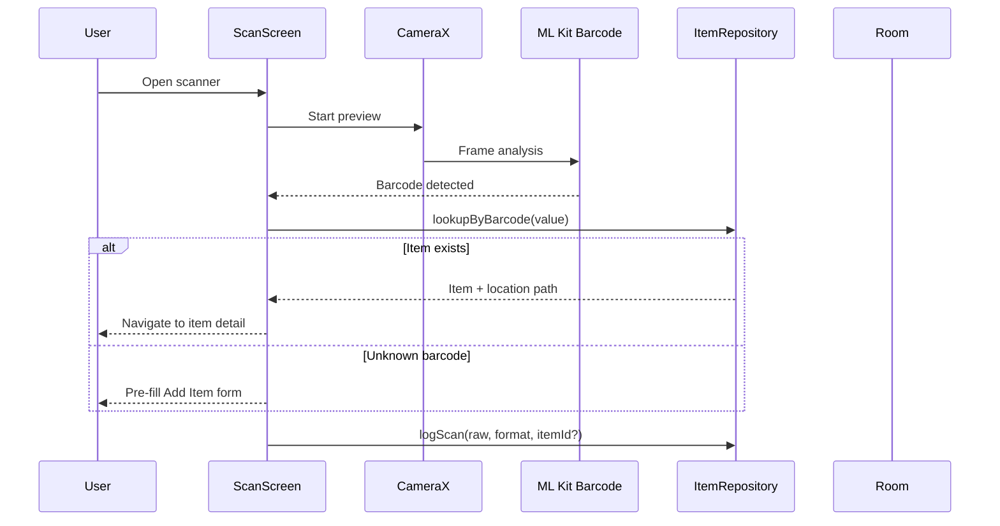

# 04 — Scanning

Barcode and QR code scanning for fast item lookup, add, and restock flows.

## Overview



## Libraries

| Component | Library |
|-----------|---------|
| Camera preview | CameraX |
| Barcode detection | ML Kit Barcode Scanning |
| Permissions | Accompanist Permissions or Activity Result API |

ML Kit runs on-device (no network required).

## Supported Formats

- EAN-13, EAN-8
- UPC-A, UPC-E
- Code-128, Code-39
- QR Code
- Data Matrix (optional)

## Scan Entry Points

| Entry | Behavior |
|-------|----------|
| Home FAB | Full-screen scanner; primary global action |
| Search screen | Toggle scan mode instead of keyboard |
| Add Item form | "Scan barcode" fills barcode field + optional name lookup |
| Restock flow | Scan existing item → open purchase log form |

## Scanner Screen UX

1. Camera preview (full screen)
2. Viewfinder overlay (rounded rect)
3. Torch toggle (low light)
4. Manual entry fallback link
5. Haptic + sound on successful read (configurable)
6. Debounce: ignore duplicate reads for 2 seconds after match

## Resolution Logic

```
onBarcodeDetected(value, format):
  1. log to scan_history
  2. item = repository.findByBarcodeOrQr(value)
  3. if item != null:
       navigate to ItemDetail(item.id)
     else:
       navigate to AddItem(prefillBarcode = value, prefillFormat = format)
```

## Optional Online Product Lookup

When network is available and barcode is unknown:

1. Query Open Food Facts or UPC Item DB
2. Prefill name, brand, category, image URL
3. User confirms before save
4. Cache result locally to avoid repeat API calls

**Never block save on network failure.**

## Permissions Flow

1. User taps Scan
2. If `CAMERA` not granted → rationale bottom sheet explaining why
3. System permission dialog
4. If denied permanently → link to app settings + manual barcode entry

## CameraX Pipeline

```kotlin
// Pseudocode
val imageAnalysis = ImageAnalysis.Builder()
    .setBackpressureStrategy(STRATEGY_KEEP_ONLY_LATEST)
    .build()

imageAnalysis.setAnalyzer(executor) { imageProxy ->
    val inputImage = imageProxy.toInputImage()
  scanner.process(inputImage)
        .addOnSuccessListener { barcodes ->
            barcodes.firstOrNull()?.let { handleBarcode(it) }
        }
        .addOnCompleteListener { imageProxy.close() }
}
```

## Data Stored Per Scan

| Field | Example |
|-------|---------|
| raw_value | `5901234123457` |
| format | `EAN_13` |
| item_id | `42` or null |
| scanned_at | epoch millis |
| source | `SEARCH` |

Useful for audit trail and "recent scans" shortcut.

## Error Handling

| Case | UX |
|------|-----|
| No camera | Show message; manual entry only |
| No barcode in frame | Passive hint: "Point at barcode" |
| Multiple barcodes | Pick largest / center-most in viewfinder |
| Damaged barcode | Manual entry + optional photo of label |

## Future: Expiry OCR

Phase 2+ enhancement using ML Kit Text Recognition:

1. User taps "Scan expiry date" on purchase form
2. Camera captures expiry region on packaging
3. OCR extracts date string → parse to `expiry_date`
4. User confirms parsed date

Not required for MVP.

## Testing

- Unit: debounce logic, barcode normalization (leading zeros)
- Instrumented: mock `BarcodeScanner` with test images
- Manual: real devices in varied lighting

## Security Notes

- QR payloads may contain URLs — do not auto-open links; show preview first
- Do not log scans to external analytics without user consent
