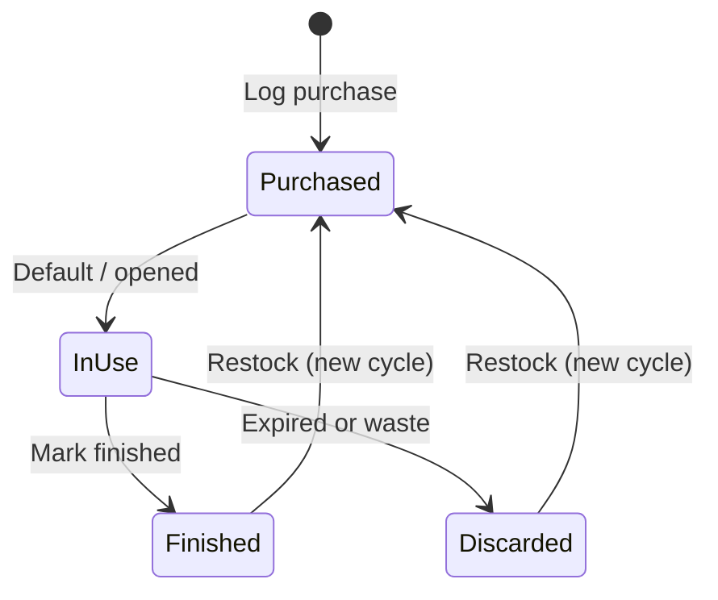

# 05 — Consumables, Expiry, and Pricing

Lifecycle tracking for consumable items: purchases, expiry, finish dates, usage duration, price trends, and replenishment.

## Consumable vs Durable

| Type | Fields | Tracking |
|------|--------|----------|
| Durable | Name, location, photos, quantity | No cycles |
| Consumable | + purchase/finish/expiry/price | `consumable_cycles` (+ optional `stock_lots`) |

Toggle `is_consumable` on item create/edit. Category-aware prompts (FOOD, MEDICINE) encourage expiry entry.

## Lifecycle States



## Consumable Cycle

One cycle = one purchase episode.

| Field | Purpose |
|-------|---------|
| purchase_date | When bought |
| finish_date | When used up (null = open) |
| expiry_date | Printed date on package |
| expiry_type | USE_BY, BEST_BEFORE, NONE |
| opened_date | Optional; seal broken |
| purchase_price | Total paid |
| quantity_purchased | Units or volume |
| store_name | For price comparison |

### Duration

```
duration_days = finish_date - purchase_date
if finish_date is null:
  duration_so_far = today - purchase_date
```

Display on item detail:

- **This cycle:** 18 days (Jan 2 → Jan 20)
- **Average:** 21 days across last N cycles
- **Estimated run-out:** purchase_date + avg_duration (if cycle open)

## Expiry

### Where expiry lives

| Level | Has expiry? |
|-------|-------------|
| Item (catalog) | No |
| Consumable cycle | Yes — per purchase |
| Stock lot (v1.3+) | Yes — per physical unit |
| items.current_expiry_date | Denormalized earliest active expiry |

### Expiry types

| Type | Label | Alert behavior |
|------|-------|----------------|
| USE_BY | Use by | Strong warning; mark expired after date |
| BEST_BEFORE | Best before | Softer "quality may decline" message |
| NONE | No expiry | No expiry alerts |

### Opened date

Optional field for products with shorter life after opening (sauces, cosmetics). Future rule example:

```
effective_expiry = min(expiry_date, opened_date + category.open_shelf_life_days)
```

Defer open-shelf-life rules to v1.3; store `opened_date` in MVP.

### Discard flow

When product expires or is thrown away before finishing:

1. User taps **Discard**
2. Set lot/cycle status to DISCARDED (or set finish_date with note)
3. Prompt: add to shopping list / log new purchase
4. Recompute `current_expiry_date` from remaining active lots

## Price Trends

### Unit price calculation

```
unit_price = purchase_price / quantity_purchased
```

### Chart data

Line chart: X = purchase_date, Y = unit_price.

Optional overlays:

- Store name per point
- % change vs previous purchase
- Average unit price (horizontal line)

### Insights cards

| Card | Calculation |
|------|-------------|
| Avg unit price | Mean of unit_price across cycles |
| Cheapest store | Store with lowest avg unit_price |
| Price change | (latest - previous) / previous × 100 |
| Total spend | Sum of purchase_price over period |

## Replenishment Alerts

Combined priority queue:

| Priority | Reason | Rule |
|----------|--------|------|
| 1 | EXPIRED | current_expiry_date &lt; today |
| 2 | EXPIRING_SOON | expiry within 3 days |
| 3 | EXPIRING_SOON | expiry within 7 days |
| 4 | LOW_STOCK | quantity ≤ min_quantity |
| 5 | USAGE_HEURISTIC | open cycle age &gt; avg_duration × 1.1 |

### Notifications

`WorkManager` daily job:

- "2 items expire this week"
- "Rice may be running low (day 28 of ~30 avg)"

User configures lead times in Settings (default 7 days).

## Shopping List

- Add from item detail, discard prompt, or low-stock alert
- Check off in store
- Checking off optionally opens **Log purchase** pre-filled

## Restock Flow

1. Scan or select item
2. Form: purchase date, price, quantity, store, **expiry date**, expiry type
3. Close any previous open cycle (prompt if still open)
4. Create new `consumable_cycle`
5. Update `items.quantity` and `items.current_expiry_date`
6. Remove from shopping list if present

## Stock Lots (v1.3+)

When one purchase includes multiple units with different expiry dates:

```
Purchase: 3× yogurt
  → lot A: expiry Jun 10
  → lot B: expiry Jun 12
  → lot C: expiry Jun 15
```

`current_expiry_date` = earliest ACTIVE lot expiry (Jun 10).

Consuming one unit decrements lot quantity; when zero, mark lot FINISHED.

## Analytics: Expiry vs Usage

Optional insight metrics:

- **Finished before expiry %** — good stewardship
- **Discarded expired count** — waste tracking
- **Avg days before expiry when finished** — purchase sizing feedback

## Repository API

```kotlin
interface ConsumableRepository {
    suspend fun startCycle(itemId: Long, data: NewCycleData): Long
    suspend fun finishCycle(cycleId: Long, finishDate: Long)
    suspend fun discardCycle(cycleId: Long, reason: String?)
    suspend fun getOpenCycle(itemId: Long): ConsumableCycle?
    suspend fun getUsageStats(itemId: Long): UsageStats
    suspend fun getPriceTrend(itemId: Long): List<PricePoint>
    suspend fun getExpiringItems(withinDays: Int): List<ItemWithLocation>
    suspend fun getExpiredItems(): List<ItemWithLocation>
    suspend fun recomputeCurrentExpiry(itemId: Long)
}
```

## Edge Cases

| Case | Handling |
|------|----------|
| New purchase before old finished | Prompt: finish/discard old cycle first |
| No expiry entered for food | Soft warning; allow save |
| min_quantity not set | Skip low-stock alert; usage heuristic only |
| Non-consumable with barcode | No cycle UI shown |
| Currency change | Store per-cycle currency; convert in UI if needed (v2) |
