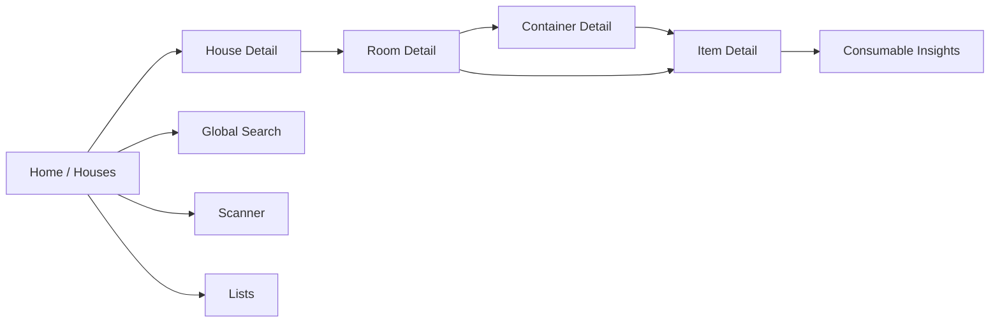
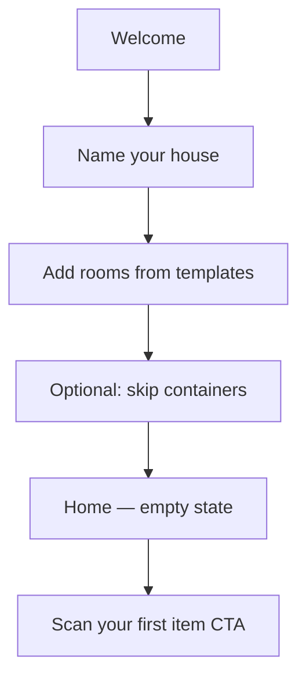

# 06 — UI Flows

Navigation structure, screen inventory, and key user journeys.

## Navigation Map



## Bottom Navigation (4 Tabs)

| Tab | Icon | Content |
|-----|------|---------|
| Browse | Home | House list → hierarchy drill-down |
| Search | Search | Text search + filter chips + scan toggle |
| Scan | Camera | Full-screen scanner (center, emphasized) |
| Lists | List | Expiring soon, shopping list, low stock |

FAB on Browse: quick **Add Item**.

## Screen Inventory

| Screen | Route | Purpose |
|--------|-------|---------|
| Onboarding | `/onboarding` | First house + template rooms |
| Houses | `/houses` | All properties |
| House detail | `/house/{id}` | Room grid/list |
| Room detail | `/room/{id}` | Containers + unassigned items |
| Container detail | `/container/{id}` | Nested containers + items |
| Item detail | `/item/{id}` | Photos, metadata, consumable panel |
| Add/Edit item | `/item/add`, `/item/{id}/edit` | Form + scan + photos |
| Location picker | bottom sheet | House → room → container breadcrumb |
| Scanner | `/scan` | Camera barcode/QR |
| Search results | `/search` | Query + filters |
| Lists hub | `/lists` | Alerts and shopping |
| Consumable insights | `/item/{id}/insights` | Charts and cycle history |
| Settings | `/settings` | Currency, alert lead time, export |

## Visual Patterns

### Location breadcrumb

Every item row and detail header shows muted path:

```
Main Home › Kitchen › Pantry Cabinet › Top Shelf
```

Tappable segments navigate up the hierarchy.

### Item list row

```
[photo]  Item Name                    ♥
         Kitchen › Drawer 2          [Consumable badge]
         Expires in 3 days           [if applicable]
```

### Status badges (consumables)

| Badge | Color semantics |
|-------|-----------------|
| OK | Neutral |
| Soon | Warning (≤7 days) |
| Expired | Error |

## Flow A: First-Time Onboarding



Template rooms: Kitchen, Bedroom, Bathroom, Garage, Living Room, Office.

## Flow B: Add Item (Scan-First)

1. Tap **+** or Scan tab
2. Scan barcode **or** choose "Enter manually"
3. **If barcode matches existing item** → Item detail
4. **If new:**
   - Name (API prefill if online)
   - Toggle **Consumable**
   - Take photo(s)
   - Pick location via hierarchical picker
   - If consumable: purchase date, price, quantity, **expiry date**, expiry type
5. Save → success snackbar with location path

### Location picker (bottom sheet)

```
House:  [Main Home        ▼]
Room:   [Kitchen          ▼]
Container: [Pantry Cabinet ▼]
          [+ New container]
```

Allow saving to room only (skip container).

## Flow C: Find Item Quickly

| Method | Steps |
|--------|-------|
| Scan | Scan → item detail → "Show location" highlights container |
| Search | Type name/brand/tag → results with location chips |
| Favorites | Home section — pinned items |
| Recent | Last 10 viewed |
| Filter | House, room, category, consumable only |

### Item detail actions

- Edit
- Move (location picker)
- Add to favorites
- Add to shopping list
- **Mark finished** (consumable)
- **Discard** (consumable, expired)
- **Log new purchase** (restock)
- View insights (consumable)

## Flow D: Consumable Finish & Restock

### Mark finished

1. Open consumable item
2. Tap **Mark as finished**
3. Confirm finish date (default today)
4. Show duration vs average
5. Dialog: "Add to shopping list?" / "Log new purchase now?"

### Log new purchase

1. Pre-filled item, location, barcode
2. Purchase date, price, quantity, store
3. **Expiry date** + type (prominent for FOOD/MEDICINE)
4. Optional opened date, receipt photo
5. Save → new cycle, update quantity and current_expiry

## Flow E: Lists Hub

Two sections with tab or segmented control:

### Expiring & expired

Sorted by expiry ascending.

```
⚠ Expired
  Milk — expired yesterday — Fridge

⏳ Expiring soon
  Yogurt — 2 days — Fridge › Top shelf
  Medicine — 5 days — Bathroom › Cabinet
```

Swipe actions: Discard, Add to shopping list.

### Shopping list

```
☐ Rice (1 bag)
☐ Olive oil (1)
☑ Batteries (checked — optionally log purchase)
```

## Flow F: Consumable Insights

Access from item detail (consumables only).

**Sections:**

1. **Summary cards** — avg usage days, avg unit price, price change %
2. **Usage chart** — bar chart of cycle durations
3. **Price chart** — line chart of unit price over time
4. **Expiry timeline** — purchase → expiry → finish per cycle
5. **History list** — all cycles, tap to expand

## Flow G: Move Item

1. Long-press item **or** Move from detail
2. Location picker
3. Confirm → update `container_id` / `room_id`
4. Snackbar with undo (5 seconds)

## Empty States

| Screen | CTA |
|--------|-----|
| No houses | "Add your first house" |
| No rooms | "Add a room" |
| No containers | "Add a cabinet or drawer" |
| No items | "Scan your first item" |
| No expiring | "Nothing expiring soon" |
| Empty shopping list | "Add from low stock or item detail" |

## Settings

| Setting | Default |
|---------|---------|
| Default house | First created |
| Currency | Locale-based |
| Expiry alert lead time | 7 days |
| Low stock notifications | On |
| Expiry notifications | On |
| Haptic on scan | On |
| Export / Import | JSON file |
| Theme | System |

## Accessibility

- Location paths readable by TalkBack as full sentence
- Minimum 48dp touch targets
- Color-blind safe badge icons (not color alone)
- Date pickers support TalkBack announcements

## Compose Screen Stubs (Routes)

```kotlin
sealed class Screen(val route: String) {
    data object Houses : Screen("houses")
    data class HouseDetail(val id: Long) : Screen("house/{id}")
    data class RoomDetail(val id: Long) : Screen("room/{id}")
    data class ContainerDetail(val id: Long) : Screen("container/{id}")
    data class ItemDetail(val id: Long) : Screen("item/{id}")
    data object AddItem : Screen("item/add?barcode={barcode}")
    data object Scan : Screen("scan")
    data object Search : Screen("search?q={q}")
    data object Lists : Screen("lists")
    data class Insights(val itemId: Long) : Screen("item/{id}/insights")
    data object Settings : Screen("settings")
}
```
