# 07 — Build Phases

Phased delivery plan with scope, acceptance criteria, and dependencies.

## Phase Overview

```mermaid
gantt
    title Delivery Phases
    dateFormat X
    axisFormat %s

    section MVP
    Hierarchy CRUD           :0, 1
    Items photos search      :1, 2

    section v1.1
    Barcode scanning         :2, 3

    section v1.2
    Consumables cycles       :3, 4
    Expiry and alerts        :4, 5

    section v1.3
    Price trends             :5, 6
    Shopping list            :6, 7
    Stock lots               :7, 8

    section v2
    Cloud sync export        :8, 9
```

*Timeline is ordinal, not calendar.*

---

## Phase 0 — Project Setup

**Scope**

- Kotlin + Compose + Hilt + Room skeleton
- Navigation graph
- Theme, typography, bottom nav shell
- Empty database v1 migration

**Done when**

- App launches to empty Houses screen
- CI runs unit tests

---

## MVP — Hierarchy & Items

**Scope**

- House, room, container CRUD (no nesting yet or simple nesting)
- Item CRUD with single/multiple photos
- Location breadcrumb
- Local text search (name, description, brand)
- Favorites and recent items
- Onboarding (first house + rooms)

**Out of scope**

- Barcode, consumables, notifications

**Acceptance criteria**

- [ ] Create house → rooms → container → item with photo
- [ ] Search finds item by name
- [ ] Item detail shows full location path
- [ ] Move item between containers
- [ ] Data persists across app restart

---

## v1.1 — Scanning

**Scope**

- CameraX + ML Kit scanner screen
- Barcode field on add/edit item
- Scan-to-find (existing item)
- Scan-to-add (unknown barcode → pre-filled form)
- Scan history table
- Manual barcode entry fallback

**Acceptance criteria**

- [ ] Scan known barcode opens item detail in &lt;2s after detection
- [ ] Unknown barcode opens add form with code filled
- [ ] Scanner works offline
- [ ] Camera permission rationale shown before request

**Depends on:** MVP

---

## v1.2 — Consumables, Expiry & Alerts

**Scope**

- `is_consumable` toggle and cycle CRUD
- Purchase date, finish date, duration display
- Expiry date + expiry type (USE_BY, BEST_BEFORE, NONE)
- Opened date (optional)
- `current_expiry_date` denormalization
- Mark finished / discard flows
- Lists tab: expiring soon + expired sections
- WorkManager daily expiry notifications
- Restock = new cycle

**Acceptance criteria**

- [ ] Log purchase with expiry on consumable item
- [ ] Item detail shows "Expires in X days" badge
- [ ] Expired items appear in Lists tab
- [ ] Notification fires for item expiring within lead time
- [ ] Finish cycle computes and displays duration
- [ ] Discard removes from active expiry alerts

**Depends on:** v1.1 (scan aids restock)

---

## v1.3 — Pricing, Shopping & Multi-Lot

**Scope**

- Purchase price, store, unit price calculation
- Price trend line chart per consumable
- Usage duration bar chart
- Shopping list (add, check off)
- Low-stock alerts (`min_quantity`)
- Usage-based replenishment heuristic
- `stock_lots` for multiple expiry per item
- Export/import JSON backup

**Acceptance criteria**

- [ ] Price chart shows unit price per purchase date
- [ ] Shopping list add from item detail and alerts
- [ ] Low-stock item appears in Lists when quantity ≤ min
- [ ] Two lots with different expiry show earliest on item row
- [ ] Export and re-import restores full hierarchy

**Depends on:** v1.2

---

## v2 — Platform & Polish

**Scope**

- Container nesting UI polish
- Optional product API lookup (Open Food Facts)
- Home screen widget (scan shortcut)
- Expiry OCR from packaging photo
- Cloud backup (Drive or Firebase)
- Multi-household sharing (stretch)

**Acceptance criteria**

- [ ] Product name prefilled from barcode when online
- [ ] Widget opens scanner
- [ ] Backup syncs photos + database

---

## Cross-Phase Quality Bar

| Area | Requirement |
|------|-------------|
| Performance | Search results &lt;200ms for 5k items |
| Offline | All core flows work in airplane mode |
| Rotation | Form state survives configuration change |
| Deletes | Cascade delete verified in DAO tests |
| Images | No OOM on 10+ photos per item (paging + compression) |

---

## Risk Register

| Risk | Mitigation |
|------|------------|
| Camera fragmentation | CameraX + fallback manual entry |
| Expiry not on barcode | Manual date picker; OCR in v2 |
| Deep container nesting UX | Limit UI depth to 3 levels; show full path |
| Database growth (photos) | Compression + optional "store in gallery" |
| Scope creep | Strict phase gates; consumable features isolated in module |

---

## Suggested First Implementation Sprint

If starting development now, build in this order:

1. Room entities: houses, rooms, containers, items, item_photos
2. Houses → Room → Container → Item navigation
3. Add item with photo + location picker
4. Search + favorites
5. Consumable cycles + expiry (before scanning if pantry-first use case)
6. Scanner integration

Adjust order if barcode-first capture is the top priority.

---

## Document Maintenance

When implementation diverges from these docs:

1. Update the relevant planning doc
2. Note change in this file under **Changelog**

### Changelog

| Date | Change |
|------|--------|
| 2026-07-08 | Initial planning docs created |
| 2026-07-08 | Added expiry date support to consumable cycles |
